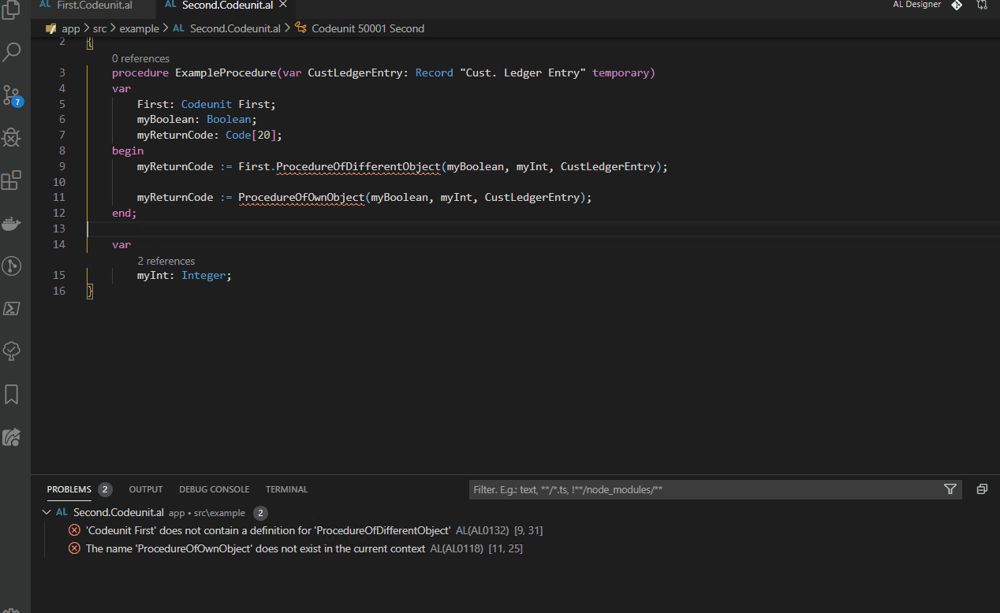

# AL CodeActions

This extension provides code actions to the diagnostics reported by the AL Language extension.

## Features

Currently there are code actions for the diagnostics AL0118 and AL0132 which are shown when there is no definition for a word in a specific file.  
Of course the code action only shows up if the object with the missing definition is inside the current workspace, so that you are able to edit the file.  

See here how it works:  

## Requirements

- AL Language extension

## Known Issues

- If you create a procedure using the code action in another app by using multi-root workspaces won't fix the error which is reported by the code analyzer.

## Release Notes

### 0.1.0

Preview release
