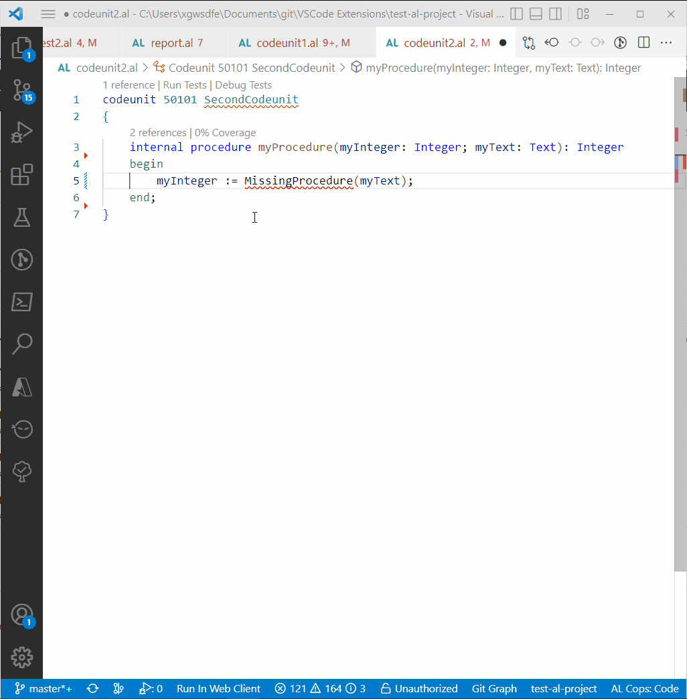

# AL CodeActions

You can support me here:

## Features

|Feature  |Description  |
|---------|---------|
|**Create Procedure / Publisher / HandlerFunction**     | There are code actions to create a missing procedure inside the same object or even of another object. The return type is identified in most cases directly if it's used as a parameter of another procedure call as example. If the procedure name starts with 'On', then you can also create an Integration Event instead (AppSourceCopPrefix could be placed before that 'On'). Furthermore it's possible to create missing handler functions. Demos: [Create Procedure](#create-procedure), [Create Publisher Events](#create-publisher-events), [Create Handler Functions](#create-handler-functions-and-use-references)       |
|**Extract Procedure**     |Select some code and extract it to a new procedure. It checks which local variables and parameters are needed inside the selected text and hands them over as parameter or adds them as local variables. For the moment the parameters are always var-Parameters, but I'm considering to improve it to check if the "var" is necessary. After the new procedure is created you can rename it directly. And I have to admit that this feature is currently not working with report dataitems because I don't recognize them as parameters yet. Before showing this feature in action in the demo section at the end of this file I would like to thank Andrzej for his support. [Demo](#extract-procedure) |
|**Extract to Label**|If you're inside a method or trigger and there's a string literal you can extract that one directly to a label. [Demo](#extract-to-label)|
|**Refactor to Validate**|You can refactor a single assignment statement to a validate statement by selecting the '*:=*' operator or by selecting the range of the assignment statement. And you can refactor multiple assignment statements to validate statements if all assignments are underneath each other. [Demo](#refactor-to-validate) |
|**References to HandlerFunctions**     | The AL language does not provide references or definitions for handler functions yet which is why you can't jump between these with F12 or Shift+F12. This extension fixed it to improve your daily test writing. [demo](#create-handler-functions-and-use-references)        |
|**References to Built in functions**|If you want to know what gets triggered if you call Customer.Insert() then this feature will not only show you the OnInsert-Trigger of the base table, but also all OnBefore-/OnAfterInsert Event Subscribers and all OnBefore-/OnAfter-/OnInsert-Triggers of the TableExtensions you developed. To see the triggered functions of the TableExtensions and EventSubscribers you have to have the AL Object Designer extension installed. Otherwise you only see the triggers of the base table. [Demo](#references-to-built-in-functions) |
|**Definition to IntegrationEvent**|On developing an EventSubscriber you specify the IntegrationEvent above the procedure declaration. You can now execute the "Go to Definition" on the IntegrationEvent you're subscribing to. It leads to the declaration of that IntegrationEvent. If AL Studio is installed as well, then this definition provider is deactivated, as AL Studio provides the same functionality and Marton and me don't want to provide you two providers. |
|**Fix implicit with-usages**     | This command uses the AL0604 warnings reported by the AL Language Extension and qualifies them with a "Rec.". If a file contains more than 100 warnings then not all usages are reported by the AL Language extension. In these cases, please execute the command a second time after the warnings are recalculated (reload window?). |

## Requirements

|              |         |
|--------------|---------|
| AL Language               |  |
| AZ AL Dev Tools/AL Code Outline           |  |

## Known Issues

- See github issues

## Thanks to

- Andrzej Zwierzchowski for your detailed explanations and helping me get started.

## Demo

### Create Procedure

### Create Handler Functions and use References

## Create Publisher Events

### Extract Procedure

  

### Extract to Label

### Refactor to Validate

### References to Built in functions*

*References to Extension and Events requires AL Object Designer

## About me

I started developing Dynamics NAV in 2014, but I always had an eye on other languages like Java or C# and was inspired by their development environment.  
Currently I work as a product developer at GWS mbH in Germany on the newest BC versions and thanks to the extensibility of VS Code it was quite obvious to me to help to improve the development environment of AL and give something small back to the awesome BC-Community. Feel free to contribute to the extension development or join us at [GWS mbH](https://www.gws.ms/en) to create some amazing BC-Apps.
