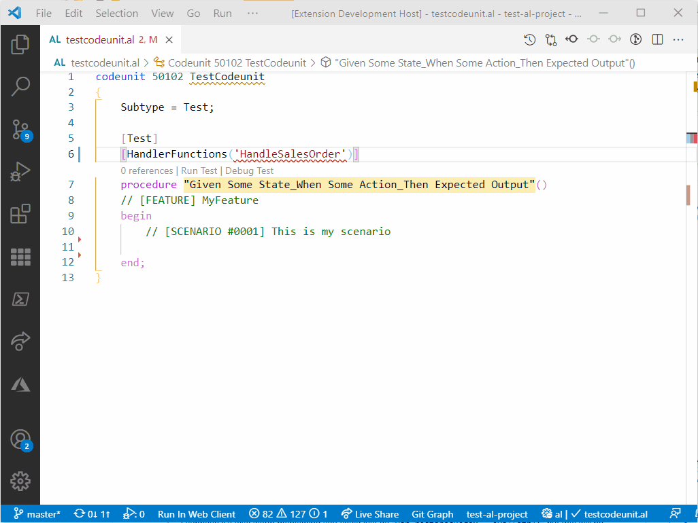
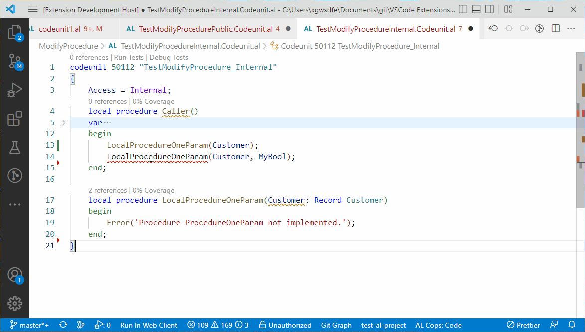

# AL CodeActions

You can support me here:

## Features

|Feature  |Description  |
|---------|---------|
|**Create Procedure / Publisher / HandlerFunction**     | There are code actions to create a missing procedure inside the same object or even of another object. The return type is identified in most cases directly if it's used as a parameter of another procedure call as example. If the procedure name starts with 'On', then you can also create an Integration Event instead (AppSourceCopPrefix could be placed before that 'On'). Furthermore it's possible to create missing handler functions. If you want your procedures placed at specific positions in your document, check out the findNewProcedureLocation-setting. Demos: [Create Procedure](#create-procedure), [Create Publisher Events](#create-publisher-events), [Create Handler Functions](#create-handler-functions-and-use-references)       |
|**Add Parameter(s) to existing procedure**|If there is an existing procedure with one parameter, but you call that with more variables, then you can now declare these variables as parameters of that existing procedure. [Demo](#add-parameters) |
|**Create overload of existing procedure**|If there is an existing procedure with one parameter, but you call that with more variables, then you can create an overload of that procedure and you're asked if you directly want to obsolete the old one. [Demo](#create-overload)|
|**Add OnBefore/OnAfter Publisher**|You can add OnBefore/OnAfter Publishers to an existing procedure. Then, while creating the publisher, you're able to select the parameters you wish to have inside and go ahead. In addition you can add a return variable on the fly, if you wish. Just "enter" it away, if you don't want to add it. [Demo](https://user-images.githubusercontent.com/53570297/127767658-58568f49-b6f1-45a8-8642-f4a9848fd559.mp4) (not in demo-section as this one is a video)|
|**Extract Procedure**     |Select some code and extract it to a new procedure. It checks which local variables and parameters are needed inside the selected text and hands them over as parameter or adds them as local variables. For the moment the parameters are always var-Parameters, but I'm considering to improve it to check if the "var" is necessary. After the new procedure is created you can rename it directly. And I have to admit that this feature is currently not working with report dataitems because I don't recognize them as parameters yet. Before showing this feature in action in the demo section at the end of this file I would like to thank Andrzej for his support. [Demo](#extract-procedure) |
|**Extract to Label**|If you're inside a method or trigger and there's a string literal you can extract that one directly to a label. [Demo](#extract-to-label)|
|**Refactor to Validate**|You can refactor a single assignment statement to a validate statement by selecting the '`:=`' operator or by selecting the range of the assignment statement. And you can refactor multiple assignment statements to validate statements if all assignments are underneath each other. [Demo](#refactor-to-validate) |
|**Make variable global**|With this code action you can make your local variable to a global one. The variable is ordered by type correctly.  [Demo](#make-variable-global)|
|**References to HandlerFunctions**     | The AL language does not provide references or definitions for handler functions yet which is why you can't jump between these with F12 or Shift+F12. This extension fixed it to improve your daily test writing. [demo](#create-handler-functions-and-use-references)        |
|**References to Built in functions**|If you want to know what gets triggered if you call Customer.Insert() then this feature will guide you to the OnInsert-Trigger of the base table. That's a benefit as such, but from there you can furthermore use the "Find related"-feature explained below, to find related OnBefore-/OnAfterInsert Event Subscribers and all OnBefore-/OnAfter-/OnInsert-Triggers of the TableExtensions you developed. [Demo](#references-to-built-in-functions) |
|**Definition to IntegrationEvent**|On developing an EventSubscriber you specify the IntegrationEvent above the procedure declaration. You can now execute the "Go to Definition" on the IntegrationEvent you're subscribing to. It leads to the declaration of that IntegrationEvent. If AL Studio is installed as well, then this definition provider is deactivated, as AL Studio provides the same functionality and Marton and me don't want to provide you two providers. |
|**Fix Cop  Warnings**| This command fixes some warnings. You are asked which one you want to fix with this run. |
|- *AA0206 (Assigned, but unused variables)*| This fix removes assignments that are safe to delete, e.g. `a := b`. Assignments with function calls like `a := myProcedure()` won't be deleted as it could change the business logic if something happens inside `myProcedure()`. |
|- *AA0137 (Remove unused variables)* | This removes all unused local and global variables and return values. Parameters, which are also part of this code cop won't be deleted yet. |  
|- *AA0008 (Missing Parentheses)* | This adds parentheses to all places where they're missing currently. |  
|**Find related (Context menu)**| In the context menu (right-click-menu) on "OnInsert"-TableTriggers there's a new group "Find related". With that you can find related event subscribers, table extension triggers or related calls that are triggering this trigger (Insert(true)). This works currently just in the workspace you've opened. It does not check the symbols yet. Furthermore the Find Calls only work on tableExtension-OnInsert Triggers yet. Modify, Delete and Field-Validate triggers are supported as well. [Demo](#find-related)|

## Requirements

|              |         |
|--------------|---------|
| AL Language               |  |
| AZ AL Dev Tools/AL Code Outline           |  |

## Known Issues

- See github issues

## Thanks to

- Andrzej Zwierzchowski for your detailed explanations and helping me get started.

## Demo

### Create Procedure

### Create Handler Functions and use References

### Add Parameters

### Create Overload

### Create Publisher Events

### Extract Procedure

  

### Extract to Label

### Refactor to Validate

### Make variable global

### References to Built in functions

### Find related

## About me

I started developing Dynamics NAV in 2014, but I always had an eye on other languages like Java or C# and was inspired by their development environment.  
Currently I work as a product developer at GWS mbH in Germany on the newest BC versions and thanks to the extensibility of VS Code it was quite obvious to me to help to improve the development environment of AL and give something small back to the awesome BC-Community. Feel free to contribute to the extension development or join us at [GWS mbH](https://www.gws.ms/en) to create some amazing BC-Apps.
